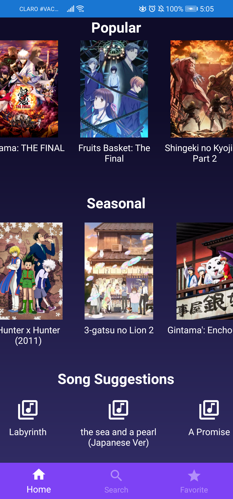
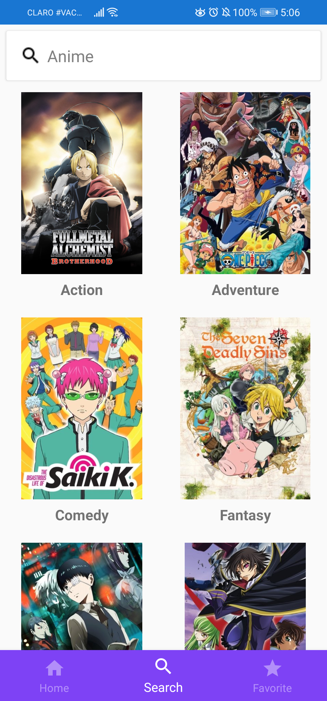
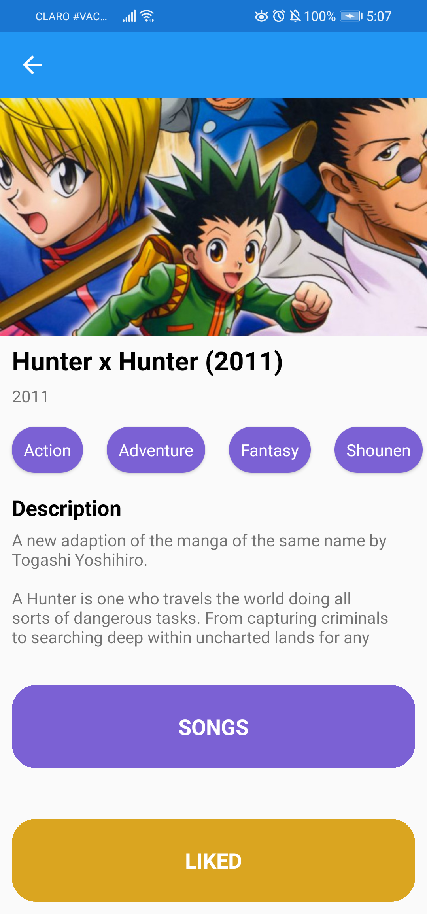
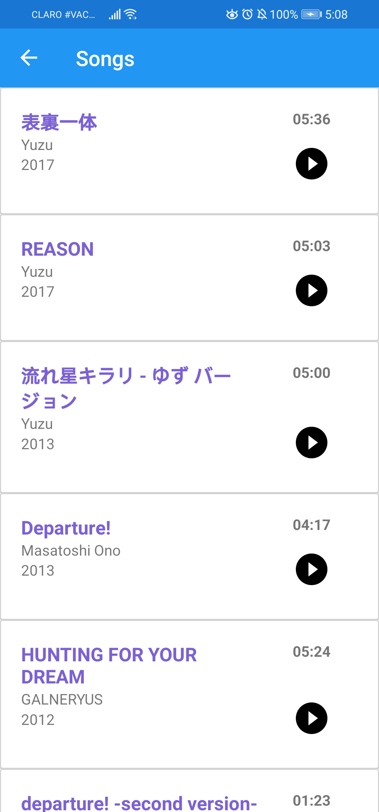

# AniHub App

## Description

Mobile app tailored for anime fans. Powered by AniAPI, Anihub offers its user the following features:
- Anime searches by name and genre
- Detailed information about any selected anime
- List of songs used in a given anime
- Access to listen to any given song through a Spotify link

### Project resources

- **Trello Board**: https://trello.com/b/AVFeZc52/anihub
- **App Mockup**: [anihub-mockup.pdf](screenshots/anihub-mockup.pdf)

## Screenshots

Main page | Home page
:--------:|:--------:
 | 

Search page | Favorite page
:-----------:|:-----------:
 | 

Anime Detail page | Anime Songs List page
:----------------:|:---------------------:
 | 

Empty search page | Search page with results
:-----------------:|:----------------------:
 | 

## Team

User | Name | INTEC ID
:----:|:----:|:-------:
[aledeltoro](https://github.com/aledeltoro) | Alejandro Encarnación | 1086298
[kelvinlee0225](https://github.com/kelvinlee0225) | Kelvin Lee | 1087781
[frankroberto20](https://github.com/frankroberto20) | Frank Chávez | 1085268

## Built With

- [NewtonSoft.Json](https://github.com/JamesNK/Newtonsoft.Json) - Json.NET is a popular high-performance JSON framework for .NET 
- [Prism.Unity.Forms](https://github.com/PrismLibrary/Prism) - Use these extensions to build Xamarin.Forms applications with Prism and Unity
- [PropertyChanged.Fody](https://github.com/Fody/PropertyChanged) - Add property notification to all classes that implement INotifyPropertyChanged
- [Refit](https://github.com/reactiveui/refit) - The automatic type-safe REST library for Xamarin and .NET
- [Xamarin.Essentials](https://github.com/xamarin/Essentials) - A kit of essential API's for your apps
- [AniAPI](https://github.com/AniAPI-Team/AniAPI) - Open-source REST API for anime streaming lovers.
